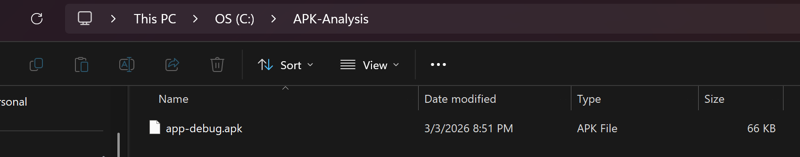
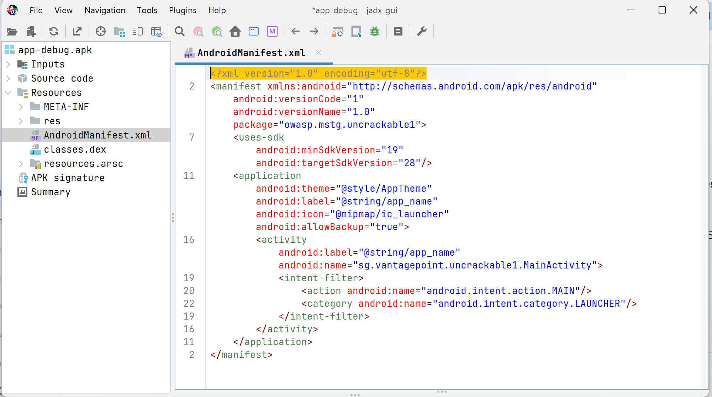
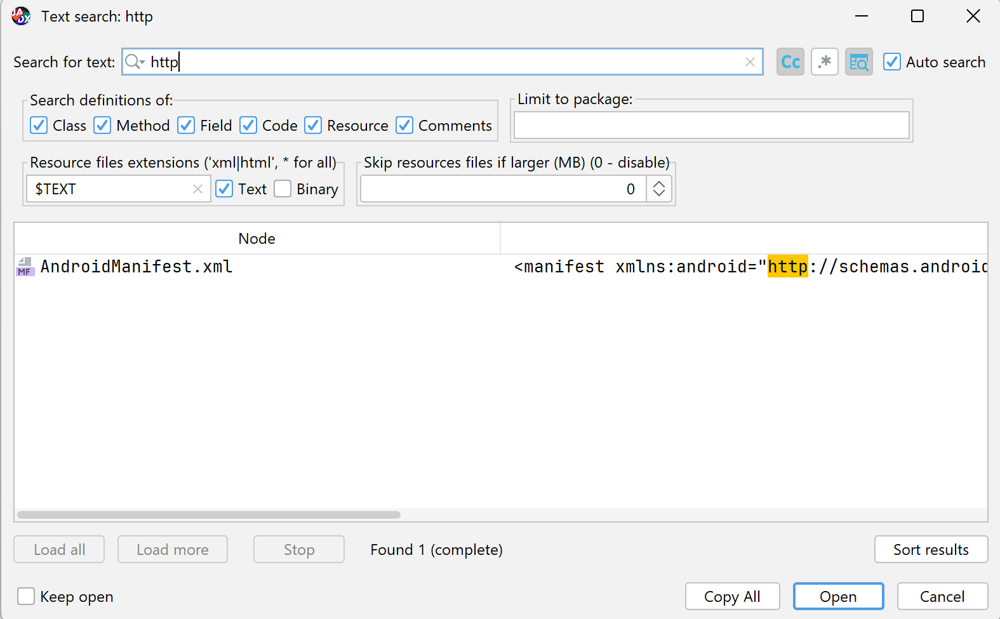
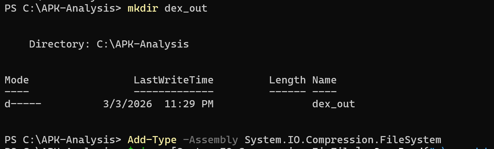
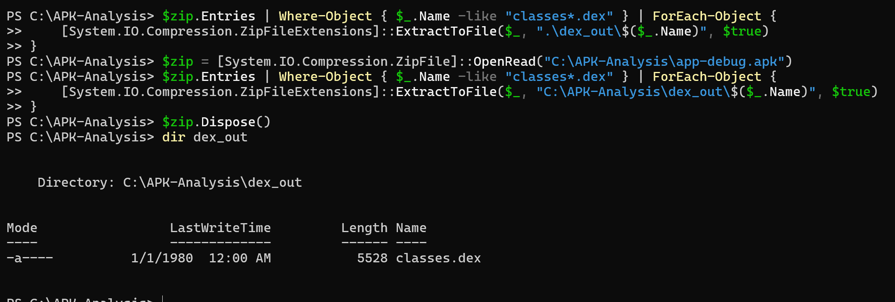
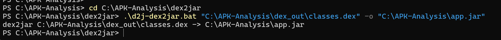
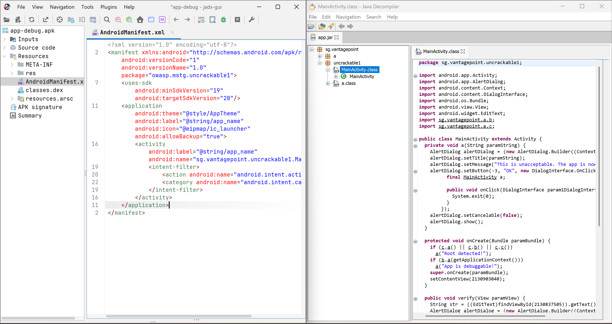

# 🛡️ Lab 4 : Analyse statique d'un APK

## 🎯 Objectif du Lab
L'objectif de ce laboratoire est de comprendre la structure interne d'une application Android (fichier `.apk`), d'analyser ses composants et de préparer le terrain pour trouver d'éventuelles vulnérabilités sans exécuter l'application.

## 🛠️ Environnement de travail
* **Système d'exploitation :** Windows
* **Terminal utilisé :** PowerShell
* **Application cible :** `app-debug.apk`

---

## 📝 Task 1 : Préparation du Workspace et vérification de l'APK

Pour commencer cette analyse proprement, j'ai mis en place une "salle blanche" (un dossier de travail dédié) et j'ai vérifié l'intégrité de mon fichier.

### 1. Création du dossier de travail
Création du dossier `C:\APK-Analysis` et copie du fichier `.apk` à l'intérieur.

### 2. Vérification de la signature ZIP de l'APK
Un fichier APK est en réalité une archive ZIP. J'ai utilisé PowerShell pour lire les premiers octets du fichier et vérifier sa signature magique (Hex: `50 4B` / ASCII: `PK`).


### 3. Lecture du contenu de l'APK sans extraction
Utilisation des librairies de compression de Windows pour lister les 20 premiers fichiers cachés dans l'APK (comme `AndroidManifest.xml` ou `classes.dex`).

### 4. Calcul de l'empreinte (Hash SHA-256)
Pour assurer la traçabilité de l'audit et prouver que le fichier n'a pas été altéré, j'ai calculé le hash SHA-256 de l'application.


---

## 📦 Task 2 : Extraire/obtenir l'APK

**En résumé :** L'objectif de cette étape est de valider la présence de l'APK dans notre environnement et de documenter son origine. J'ai opté pour l'Option A de mon laboratoire.

**Check-list de validation :**
* ✅ **Disponibilité :** L'APK est bien présent dans le dossier de travail `C:\APK-Analysis`.
* ✅ **Provenance :** Application d'entraînement fournie (OWASP UnCrackable Level 1), renommée en `app-debug.apk` pour les besoins du lab.
* ✅ **Taille de l'APK :** 66 Ko.



---

## 🔍 Task 3 : Analyse avec JADX GUI

**En résumé :** J'ai utilisé JADX GUI pour décompiler l'APK et analyser son fichier `AndroidManifest.xml`. Ce fichier est crucial car il déclare les permissions, les composants et les règles de sécurité de l'application.

### 1. Informations générales de l'application
En lisant le Manifeste, j'ai pu extraire la carte d'identité de l'APK :
* **Package principal :** `owasp.mstg.uncrackable1`
* **Version (versionName) :** `1.0`
* **Version Minimale du SDK (minSdk) :** `19`
* **Version Cible du SDK (targetSdk) :** `28`

### 2. Analyse des permissions
* **Résultat :** Aucune balise `<uses-permission>` n'est présente dans le manifeste. L'application ne requiert aucun accès spécifique au système (caméra, contacts, localisation, etc.).

### 3. Analyse des composants
* L'application possède une activité principale : `sg.vantagepoint.uncrackable1.MainActivity`.
* ⚠️ **Attention de sécurité (Surface d'attaque) :** Cette activité possède un `<intent-filter>` (`android.intent.action.MAIN`). Cela signifie qu'elle est implicitement exportée et peut être lancée par le système ou d'autres applications.

### 4. Configurations de sécurité sensibles
* **CleartextTraffic / Debuggable :** Les attributs `android:usesCleartextTraffic="true"` et `android:debuggable="true"` sont absents. Bonne pratique de sécurité respectée.
* 🚨 **Vulnérabilité identifiée :** L'attribut `android:allowBackup="true"` est présent. Cela constitue un risque de fuite de données, car un attaquant disposant d'un accès physique pourrait extraire les données de l'application via la commande `adb backup`.



---

## 🕵️ Task 4 : Recherche de chaînes sensibles

**En résumé :** L'objectif de cette étape est d'utiliser la fonction de recherche globale de JADX GUI pour débusquer d'éventuelles informations sensibles (mots de passe, clés d'API, URLs cachées) codées en dur par les développeurs. Conformément à la grille de sévérité du laboratoire, voici le rapport des 5 observations demandées.

### Observation 1 : Recherche d'URLs (`http://` / `https://`)
* **Valeur trouvée :** `http://schemas.android.com/apk/res/android`
* **Emplacement :** `AndroidManifest.xml` (balise `manifest`)
* **Niveau de risque :** Faible 🟢
* **Description :** Il s'agit simplement de l'URL standard et publique utilisée par le système Android pour définir les règles du fichier XML. Il n'y a aucune fuite de données ici.



---

## 🔄 Task 5 : Convertir DEX en JAR avec dex2jar

**En résumé :** Le code de l'application est initialement compilé au format `.dex` (Dalvik Executable), optimisé pour Android mais difficile à analyser avec des outils Java classiques. L'objectif de cette étape est d'isoler ce fichier et de le traduire en une archive standard `.jar`.

### 1. Extraction du fichier DEX
J'ai utilisé PowerShell pour décompresser l'APK de manière ciblée et extraire uniquement le cœur de l'application (`classes.dex`) dans un dossier `dex_out`.





### 2. Conversion en JAR
J'ai ensuite utilisé l'outil en ligne de commande `dex2jar` pour effectuer la traduction. L'opération a généré avec succès le fichier `app.jar`.

```powershell
cd C:\APK-Analysis\dex2jar
.\d2j-dex2jar.bat "C:\APK-Analysis\dex_out\classes.dex" -o "C:\APK-Analysis\app.jar"
```



---

## ⚖️ Task 6 : Comparaison JADX vs JD-GUI

**En résumé :** L'objectif de cette étape est de comparer l'efficacité et le rendu de deux outils de décompilation différents : JADX GUI (qui décompile directement l'APK) et JD-GUI (qui lit le fichier JAR généré via dex2jar).

Pour cette comparaison, j'ai analysé la même classe dans les deux outils : `sg.vantagepoint.uncrackable1.MainActivity`.

### Tableau comparatif (3 différences notables)

| Aspect | JADX GUI | JD-GUI |
| :--- | :--- | :--- |
| **Navigation & Structure** | Affiche la structure Android complète (AndroidManifest, ressources, code source). | Affiche uniquement la structure Java pure (packages, classes). Les spécificités Android sont absentes. |
| **Gestion des Ressources** | Accès direct et lisible aux ressources (fichiers XML, assets, etc.). | Pas d'accès aux ressources Android, l'outil se concentre uniquement sur le bytecode Java. |
| **Lisibilité (Obfuscation)** | Tente de reconstruire logiquement les noms de variables et offre une meilleure lisibilité globale. | Conserve très souvent les noms obfusqués (ex: `a`, `b`, `c`), ce qui rend la lecture de la logique plus complexe. |

### Conclusion et outil le plus adapté

* **Forces et faiblesses :** JADX est un outil "tout-en-un" parfaitement taillé pour l'écosystème Android, mais il peut parfois échouer sur des APK très complexes ou très obfusqués. JD-GUI est plus basique et rudimentaire pour de l'Android, mais la conversion préalable par `dex2jar` permet parfois de contourner certaines protections anti-décompilation qui feraient planter JADX.
* **Verdict :** Pour un audit d'application mobile classique, **JADX GUI est largement supérieur et plus adapté** grâce à sa prise en charge native des ressources Android (comme le Manifeste) et sa meilleure lisibilité du code. JD-GUI + dex2jar reste cependant un excellent plan B à garder sous le coude.



---

## 📋 Task 7 : Mini-rapport d'analyse statique

# Rapport d'analyse statique - UnCrackable Level 1

## A) Informations générales
- **Date d'analyse :** 4 Mars 2026
- **Analyste :** Oumayma Benhilal
- **APK analysé :** `app-debug.apk`
- **Version :** `1.0` (targetSdk: 28)
- **Provenance :** Application d'entraînement OWASP (fournie)
- **Outils utilisés :** PowerShell, JADX GUI, dex2jar, JD-GUI

---

## B) Résumé exécutif
Cette analyse statique a révélé **1 vulnérabilité potentielle** liée à la configuration et a mis en évidence des **mécanismes d'auto-protection** dans l'application UnCrackable Level 1.

Les principales préoccupations concernent l'autorisation de sauvegarde des données (Backup), qui pourrait conduire à une fuite d'informations locales. L'application est par ailleurs bien configurée (aucune permission inutile, pas de trafic en clair).

Le niveau de risque global est évalué comme **Moyen**.

**Actions prioritaires recommandées :**
1. Désactiver la sauvegarde ADB dans le manifeste.
2. S'assurer que les données manipulées par la `MainActivity` (exportée par défaut) sont validées.

---

## C) Constats détaillés

### Constat #1 : Sauvegarde des données applicatives autorisée
- **Sévérité :** Moyenne 🟡
- **Description :** L'attribut `android:allowBackup="true"` est activé. Cela permet à quiconque de sauvegarder et de restaurer les données privées de l'application.
- **Localisation :** `AndroidManifest.xml` (dans la balise `<application>`)
- **Impact potentiel :** Un attaquant disposant d'un accès physique au téléphone déverrouillé (ou d'un accès ADB) pourrait extraire des données sensibles stockées localement par l'application via la commande `adb backup`.
- **Remédiation recommandée :** Définir explicitement l'attribut `android:allowBackup="false"` dans le manifeste pour les applications traitant des données sensibles.

### Constat #2 : Présence de mécanismes Anti-Débogage
- **Sévérité :** Information / Faible 🟢
- **Description :** Le code source contient des appels de méthodes visant à vérifier si un outil de débogage est connecté au processus de l'application.
- **Localisation :** Classes Java (ex: appel à `android.os.Debug.isDebuggerConnected()`)
- **Impact potentiel :** Ce n'est pas une faille, mais une protection. Cela complique l'analyse dynamique pour les auditeurs de sécurité et ralentit l'exploitation par des attaquants.
- **Remédiation recommandée :** Bonne pratique respectée. Aucune remédiation nécessaire.

### Constat #3 : Activité principale exportée implicitement
- **Sévérité :** Faible 🟢
- **Description :** Le composant `MainActivity` est accessible depuis l'extérieur du bac à sable de l'application car il contient un filtre d'intention (`intent-filter`).
- **Localisation :** `AndroidManifest.xml` (`sg.vantagepoint.uncrackable1.MainActivity`)
- **Impact potentiel :** Étant le point d'entrée de l'application (Action `MAIN`, Catégorie `LAUNCHER`), il est normal qu'elle soit exportée. Cependant, cela représente la surface d'attaque principale via les Intents externes.
- **Remédiation recommandée :** S'assurer qu'aucune donnée reçue via l'Intent de lancement n'est traitée sans validation stricte.

---

## D) Annexes

### Permissions demandées
- *Aucune permission* (`<uses-permission>`) n'est requise par l'application.

### Composants exportés
- `sg.vantagepoint.uncrackable1.MainActivity` (Exporté implicitement via `intent-filter`)

---

## 🧹 Task 8 : Nettoyage

**En résumé :** La dernière étape de cet audit a consisté à sécuriser l'environnement de travail en organisant les livrables et en supprimant les traces d'analyse.

### 1. Vérification et Organisation
* **Vérification :** Le présent rapport a été relu. S'agissant d'une application d'entraînement (UnCrackable L1), aucune véritable donnée personnelle, token ou mot de passe de production n'a été exposé.
* **Organisation :** Le code Java traduit (`app.jar`) a été archivé dans un dossier `/results`.

### 2. Nettoyage des artefacts
Pour des raisons de sécurité et de conformité, les fichiers de travail temporaires ont été détruits.

```powershell
Remove-Item -Recurse -Force .\dex_out
Remove-Item .\app-debug.apk
```
