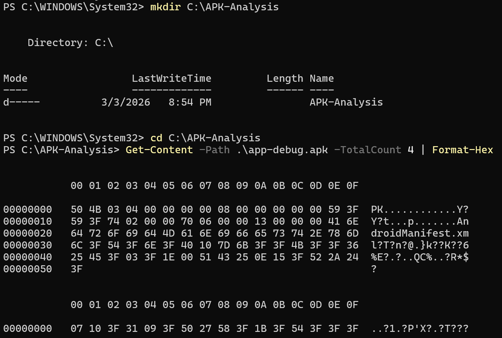
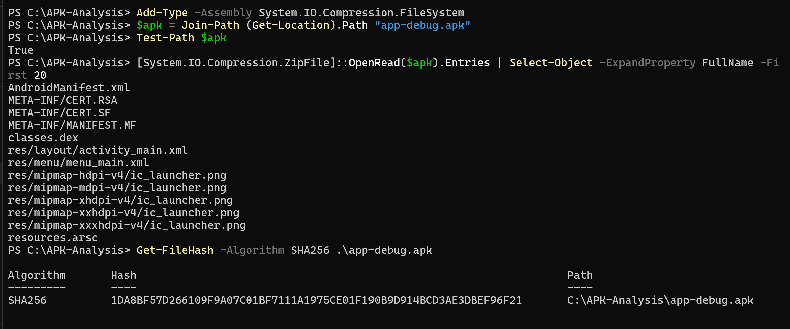

# 🛡️ Lab 4 : Analyse statique d'un APK

## 🎯 Objectif du Lab
L'objectif de ce laboratoire est de comprendre la structure interne d'une application Android (fichier `.apk`), d'analyser ses composants et de préparer le terrain pour trouver d'éventuelles vulnérabilités sans exécuter l'application.

## 🛠️ Environnement de travail
* **Système d'exploitation :** Windows
* **Terminal utilisé :** PowerShell
* **Application cible :** `app-debug.apk`

---

## 📝 Task 1 : Préparation du Workspace et vérification de l'APK

Pour commencer cette analyse proprement, j'ai mis en place une "salle blanche" (un dossier de travail dédié) et j'ai vérifié l'intégrité de mon fichier.

### 1. Création du dossier de travail
Création du dossier `C:\APK-Analysis` et copie du fichier `.apk` à l'intérieur.

### 2. Vérification de la signature ZIP de l'APK
Un fichier APK est en réalité une archive ZIP. J'ai utilisé PowerShell pour lire les premiers octets du fichier et vérifier sa signature magique (Hex: `50 4B` / ASCII: `PK`).

### 3. Lecture du contenu de l'APK sans extraction
Utilisation des librairies de compression de Windows pour lister les 20 premiers fichiers cachés dans l'APK (comme `AndroidManifest.xml` ou `classes.dex`).

### 4. Calcul de l'empreinte (Hash SHA-256)
Pour assurer la traçabilité de l'audit et prouver que le fichier n'a pas été altéré, j'ai calculé le hash SHA-256 de l'application.

